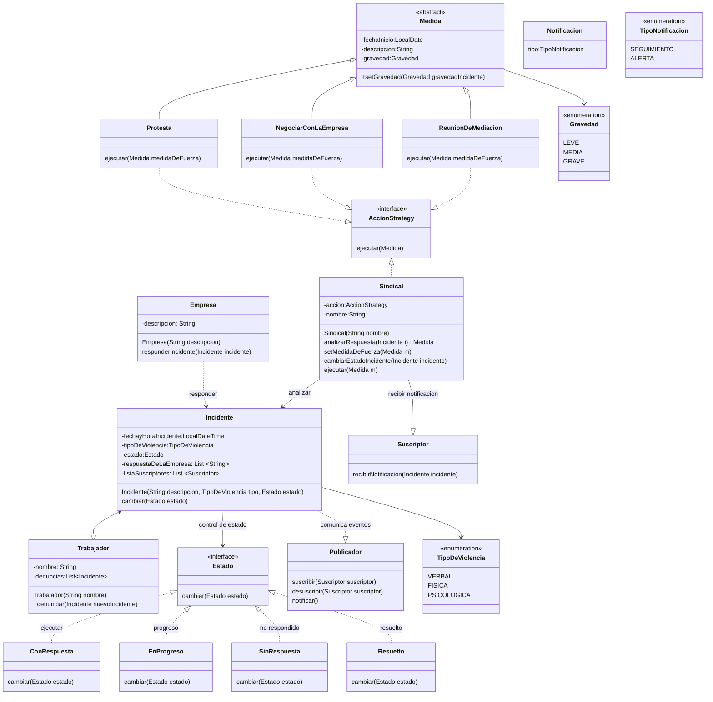

# Primer Parcial de Diseño de Sistemas

**Nombre:** _________________ **Legajo:** _________  
**Fecha:** 26-8-2024

---

## Ejercicio 1

### Contexto:

Un sindicato de trabajadores está desarrollando un sistema para gestionar y analizar denuncias sobre incidentes de violencia laboral en distintas empresas. El objetivo del sistema es registrar las denuncias realizadas por los trabajadores y permitir que los representantes sindicales sigan el progreso de cada caso, brindando apoyo y ofreciendo alertas cuando sea necesario tomar medidas, como reuniones de mediación o protestas.

El sistema debe ser capaz de gestionar dos tipos de notificaciones:
1. Notificaciones de seguimiento de casos, que informan a los trabajadores y representantes sindicales sobre el estado de las denuncias presentadas.
2. Alertas de acción sindical, que notifica a los representantes sindicales y a los trabajadores cuando es necesario intervenir, como convocar reuniones de emergencia, realizar protestas o coordinar negociaciones con la empresa.

El sistema debe ser flexible y permitir la implementación de diferentes métodos de manejo de casos basadas en la gravedad del incidente, el tipo de violencia (verbal, física, psicológica) y la respuesta de la empresa.

### Requisitos:

1. **Usuarios y notificaciones:**
    - El sistema debe permitir que los trabajadores y los representantes sindicales se suscriban a notificaciones sobre el progreso de los casos.
    - Cada vez que se actualice un caso (nueva evidencia, reuniones programadas, cambios en la negociación), los usuarios suscritos deben ser notificados automáticamente.
    - Además, los representantes sindicales deben poder recibir alertas de acción sindical cuando es necesario movilizar recursos o tomar medidas urgentes.

2. **Métodos de manejo de casos:**
    - El sistema debe permitir cambiar dinámicamente la estrategia de manejo de un caso. Por ejemplo, un incidente de violencia verbal puede requerir una de gestión distinta de acuerdo un caso de acoso físico o psicológico prolongado.
    - Implementar al menos dos estrategias de manejo: una para incidentes leves (que prioricen la mediación rápida) y otra para incidentes graves (que requieran intervención legal y medidas disciplinarias).

### Consignas:

1. Modelar las clases necesarias para representar a los Usuarios, el Sistema de notificaciones y el Manejo de casos.
2. Utilizar los patrones de diseño que considere adecuados.

---

## Ejercicio 2

Mencione tres atributos de calidad que considere los más importantes, basándose en la norma ISO/IEC 25010 (que reemplaza a la norma ISO/IEC 9126). Justifique su elección en el contexto del sistema planteado en el Ejercicio 1. Justifique la elección de cada atributo.