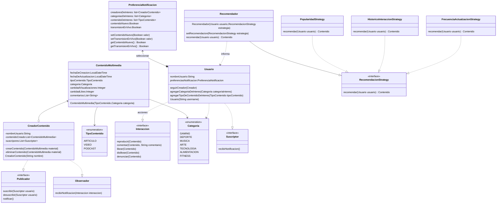

```mermaid
classDiagram
    
    class CreadorContenido{
        -nombreUsuario:String 
        -contenidoCreado:List~ContenidoMultimedia~
        -suscripores:List~Suscriptor~
        -crearContenido(ContenidoMultimedia material)
        -eliminarContenido(ContenidoMultimedia material)
        
        CreadorContenido(String nombre)
    }
    
    class ContenidoMultimedia{
        fechaDeCreacion:LocalDateTime
        fechaDeActualizacion:LocalDateTime
        tipoContenido:TipoContenido
        categoria:Categoria
        cantidadVisualizaciones:Integer
        cantidadLikes:Integer
        comentarios:List~String~

        
        ContenidoMultimedia(TipoContenido,Categoria categoria)

    }
    

  
    class TipoContenido{
        <<enumeration>>
        ARTICULO
        VIDEO
        PODCAST
    }

    
    class Publicador{
        <<interface>>
        suscribir(Suscriptor usuario)
        desuscribir(Suscriptor usuario)
        notificar()
    }
    
    
    
    class Usuario{
        nombreUsuario:String
        preferenciasNotificacion:PreferenciaNotificacion
        
        seguirCreador(Creador)
        agregarCategoriaDeInteres(Categoria categoriaInteres)
        agregarTipoDeContenidoDeInteres(TipoContenido tipoContenido)
        
        Usuario(String username)
    }
    

    class Interaccion{
        <<interface>>
        reproducir(Contenido )
        comentar(Contenido, String comentario)
        likear(Contenido)
        dislikear(Contenido)
        denunciar(Contenido)
    }
    
    class PreferenciaNotificacion{
        creadoresDeInteres: list~CreadorContenido~
        categoriasDeInteres: list~Categoria~
        contenidoDeInteres: list~TipoContenido~
        contenidoNuevo:Boolean
        transmisionEnVivo:Boolean
        
        setContenidoNuevo(Boolean valor)
        setTransmisionEnVivo(Boolean valor)
        getContenidoNuevo() Boolean
        getTransmisionEnVivo() Boolean
        
    }
    
    class Categoria{
        <<enumeration>>
        GAMING
        DEPORTE
        MUSICA
        ARTE
        TECNOLOGIA
        ALIMENTACION
        FITNESS
    }
    
    
    class Suscriptor{
        <<interface>>
        recibirNotificacion()
    }

    class Recomendador{
        Recomendador(Usuario usuario,RecomendacionStrategy estrategia)
        setRecomendacion(RecomendacionStrategy estrategia)
        recomendar(Usuario usuario) Contenido
    }

    class RecomendacionStrategy{
        <<interface>>
        recomendar(Usuario usuario) Contenido
    }

    class PopularidadStrategy{
        recomendar(Usuario usuario) Contenido
    }

    class HistoricoInteraccionStrategy{
        recomendar(Usuario usuario) Contenido
    }

    class FrecuenciaActualzacionStrategy{
        recomendar(Usuario usuario) Contenido
    }
    
    class Observador{
        recibirNotificacion(Interaccion interaccion)
    }

    ContenidoMultimedia --> Categoria
    ContenidoMultimedia --> TipoContenido
    ContenidoMultimedia <--o CreadorContenido
    CreadorContenido ..|>Publicador
    CreadorContenido ..|>Observador
    Usuario ..|> Interaccion:acciones
    Usuario ..|> Suscriptor
    Usuario ..> Categoria
    PreferenciaNotificacion <--* Usuario: seleccionar
    Recomendador ..> Usuario:informa
    Recomendador --|> RecomendacionStrategy
    PopularidadStrategy ..|> RecomendacionStrategy
    HistoricoInteraccionStrategy ..|> RecomendacionStrategy
    FrecuenciaActualzacionStrategy ..|> RecomendacionStrategy


    
    
```