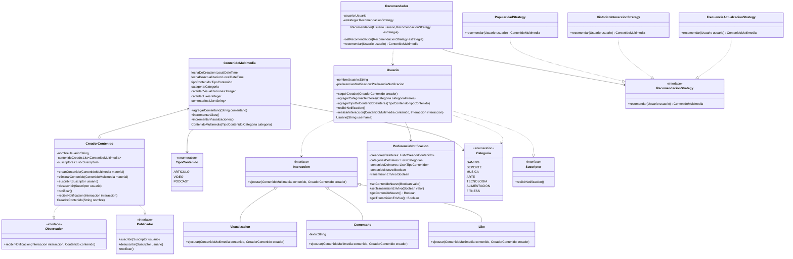

```mermaid
classDiagram
    
    class CreadorContenido{
        -nombreUsuario:String 
        -contenidoCreado:List~ContenidoMultimedia~
        -suscriptores:List~Suscriptor~
        +crearContenido(ContenidoMultimedia material)
        +eliminarContenido(ContenidoMultimedia material)
        +suscribir(Suscriptor usuario)
        +desuscribir(Suscriptor usuario)
        +notificar()
        +recibirNotificacion(Interaccion interaccion)
        
        CreadorContenido(String nombre)
    }
    
    class ContenidoMultimedia{
        fechaDeCreacion:LocalDateTime
        fechaDeActualizacion:LocalDateTime
        tipoContenido:TipoContenido
        categoria:Categoria
        cantidadVisualizaciones:Integer
        cantidadLikes:Integer
        comentarios:List~String~
        
        +agregarComentario(String comentario)
        +incrementarLikes()
        +incrementarVisualizaciones()
        
        ContenidoMultimedia(TipoContenido,Categoria categoria)
    }
    
    class TipoContenido{
        <<enumeration>>
        ARTICULO
        VIDEO
        PODCAST
    }

    class Publicador{
        <<interface>>
        +suscribir(Suscriptor usuario)
        +desuscribir(Suscriptor usuario)
        +notificar()
    }
    
    class Usuario{
        -nombreUsuario:String
        -preferenciasNotificacion:PreferenciaNotificacion
        
        +seguirCreador(CreadorContenido creador)
        +agregarCategoriaDeInteres(Categoria categoriaInteres)
        +agregarTipoDeContenidoDeInteres(TipoContenido tipoContenido)
        +recibirNotificacion()
        +realizarInteraccion(ContenidoMultimedia contenido, Interaccion interaccion)
        
        Usuario(String username)
    }

    class Interaccion{
        <<interface>>
        +ejecutar(ContenidoMultimedia contenido, CreadorContenido creador)
    }

    class Like{
        +ejecutar(ContenidoMultimedia contenido, CreadorContenido creador)
    }

    class Comentario{
        -texto:String
        +ejecutar(ContenidoMultimedia contenido, CreadorContenido creador)
    }

    class Visualizacion{
        +ejecutar(ContenidoMultimedia contenido, CreadorContenido creador)
    }
    
    class PreferenciaNotificacion{
        -creadoresDeInteres: List~CreadorContenido~
        -categoriasDeInteres: List~Categoria~
        -contenidoDeInteres: List~TipoContenido~
        -contenidoNuevo:Boolean
        -transmisionEnVivo:Boolean
        
        +setContenidoNuevo(Boolean valor)
        +setTransmisionEnVivo(Boolean valor)
        +getContenidoNuevo() Boolean
        +getTransmisionEnVivo() Boolean
    }
    
    class Categoria{
        <<enumeration>>
        GAMING
        DEPORTE
        MUSICA
        ARTE
        TECNOLOGIA
        ALIMENTACION
        FITNESS
    }
    
    class Suscriptor{
        <<interface>>
        +recibirNotificacion()
    }

    class Observador{
        <<interface>>
        +recibirNotificacion(Interaccion interaccion, Contenido contenido)
    }

    class Recomendador{
        -usuario:Usuario
        -estrategia:RecomendacionStrategy
        Recomendador(Usuario usuario,RecomendacionStrategy estrategia)
        +setRecomendacion(RecomendacionStrategy estrategia)
        +recomendar(Usuario usuario) ContenidoMultimedia
    }

    class RecomendacionStrategy{
        <<interface>>
        +recomendar(Usuario usuario) ContenidoMultimedia
    }

    class PopularidadStrategy{
        +recomendar(Usuario usuario) ContenidoMultimedia
    }

    class HistoricoInteraccionStrategy{
        +recomendar(Usuario usuario) ContenidoMultimedia
    }

    class FrecuenciaActualzacionStrategy{
        +recomendar(Usuario usuario) ContenidoMultimedia
    }

    %% Relaciones principales
    ContenidoMultimedia --> Categoria
    ContenidoMultimedia --> TipoContenido
    ContenidoMultimedia <--o CreadorContenido
    CreadorContenido ..|> Publicador
    CreadorContenido ..|> Observador
    Usuario ..|> Suscriptor
    Usuario ..> Categoria
    Usuario --> PreferenciaNotificacion
    Usuario ..> Interaccion
    Interaccion <|-- Like
    Interaccion <|-- Comentario
    Interaccion <|-- Visualizacion
    Recomendador ..> Usuario
    Recomendador --> RecomendacionStrategy
    PopularidadStrategy ..|> RecomendacionStrategy
    HistoricoInteraccionStrategy ..|> RecomendacionStrategy
    FrecuenciaActualzacionStrategy ..|> RecomendacionStrategy


```