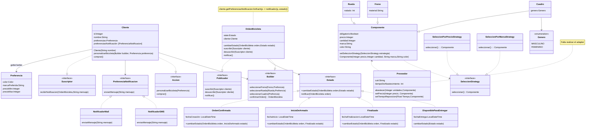

```mermaid
    classDiagram
        class Cliente{
            id:Integer
            nombre:String
            preferencias:Preferencia
            preferenciasNotificación: [PreferenciaNotificacion]
            Cliente(String nombre)
            personalizarBicicleta(Builder builder, Preferencia preferencia)
            %%descontar stock luego de comprar
            comprar() 
        }

    Cliente --> Preferencia : getter/setter
    class Accion{
        <<interface>>
        personalizarBicicleta(Preferencia)
        comprar()
    }
        
        class Suscriptor{
            <<interface>>
            recibirNotificacion(OrdenBicicleta,String mensaje)
        }
        
        Cliente ..|> Suscriptor
        
        class Preferencia{
            color:Color
            marcaPreferida:String
            precioMin:Integer
            precioMax:Integer
            
        }
        
        class OrdenBicicleta{
            state:Estado
            cliente:Cliente
            cambiarEstado(OrdenBicibleta orden,Estado estado)
            suscribir(Suscriptor cliente)
            desuscribir(Suscriptor cliente)
            notificar()
            %% cliente.getPreferenciasNotificacion.forEach(p -> notificador(p, estado))
        }

        note for OrdenBicicleta "cliente.getPreferenciasNotificacion.forEach(p -> notificador(p, estado))"
        class Publicador{
        <<interface>>
        suscribir(Suscriptor cliente)
        desuscribir(Suscriptor cliente)
        notificar()
        }
         OrdenBicicleta ..|> Publicador

    OrdenBicicleta --> Estado
        
        class Estado{
         <<interface>>  
         +cambiarEstado(OrdenBicibleta orden,Estado estado)
         notificar(OrdenBicicleta orden)
        }
        
        class OrdenConfirmada{
            fechaCreación: LocalDateTime
            +cambiarEstado(OrdenBicibleta orden, InicioDeArmado estado)
        }
        
        class InicioDeArmado{
            fechaInicio: LocalDateTime
            +cambiarEstado(OrdenBicibleta orden, Finalizado estado)
        }
        
        class Finalizado{
            fechaFinalizacion:LocalDateTime
            +cambiarEstado(OrdenBicibleta orden, Finalizado estado)
        }
        
        class DisponibleParaEntregar{
            fechaEntrega:LocalDateTime
            cambiarEstado(Estado estado)
        }
        
        Estado <|.. OrdenConfirmada
        Estado <|.. InicioDeArmado
        Estado <|.. Finalizado
        Estado <|.. DisponibleParaEntregar
        Cliente --> PreferenciaNotificacion
        PreferenciaNotificacion  <|..NotificadorMail
        PreferenciaNotificacion   <|..NotificadorSMS
        class PreferenciaNotificacion{
            <<interface>>
            enviarMensaje(String mensaje)
        }

        class NotificadorMail{
            enviarMensaje(String mensaje)
        }

        class NotificadorSMS{
            enviarMensaje(String mensaje)
        }

        class Componente{
            obligatorio:Boolean
            precio:Integer
            cantidad:Integer
            marca:String
            color:String
                
            setSeleccionStrategy(SeleccionStrategy estrategia)
            Componente(Integer precio,Integer cantidad, String marca,String  color)
        }
        
        Componente <.. Proveedor
        Rueda --|> Componente
        Freno --|> Componente
        Cuadro --|> Componente
        
        class SeleccionStrategy{
        <<interface>>
            seleccionar() Componente
        }
 
        class SeleccionPorPrecioStrategy{
            seleccionar(): Componente
        }
        
        class SeleccionPorMarcaStrategy{
            seleccionar(): Componente
        }
        
        Componente ..> SeleccionStrategy
        SeleccionPorPrecioStrategy ..|> SeleccionStrategy
        SeleccionPorMarcaStrategy ..|> SeleccionStrategy
        
        class Cuadro{
            genero:Genero
        }
        class Genero{
            <<enumeration>>
            MASCULINO
            FEMENINO
        }
        
        Cuadro -->Genero
        
        class Rueda{
            rodado: Int
        }
        
        class Freno{
            material:String
        }
        
        class Proveedor{
            cuit:String
            tiempoDeAbastecimiento: Int
            abastecer(Integer unidades,Componente)
            setPrecio(Integer precio, Componente)
            setTiempoReposicion(Float Tiempo,Componente)
        }
        
        note for Proveedor "Falta realizar el adapter"
        
        class Builder {
            <<interface>>
            seleccionarFreno(Freno,Prefrencia)
            seleccionarRueda(Rueda,Prefrencia)
            seleccionarCuadro(Prefrencia)
            confirmarOrden() OrdenBicicleta
        }
        


        OrdenBicicleta ..|> Builder
        
        Cliente ..|>Accion
        Cliente --> Builder

%%    Armador --> Builder

%%   class Armador{
      %%      nombre:String
      %%      listBicicleta:List~Bicicleta~
      %%      builder:Builder
      %%      Cliente(String nombre)

     %%   }      
```