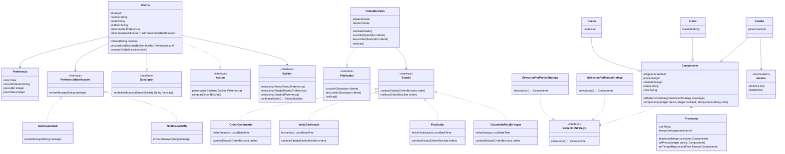

```mermaid
classDiagram
    class Cliente{
        id:Integer
        nombre:String
        email:String
        telefono:String
        preferencias:Preferencia
        preferenciasNotificación: List~PreferenciaNotificacion~
        Cliente(String nombre)
        personalizarBicicleta(Builder builder, Preferencia pref)
        comprar(OrdenBicicleta orden) 
    }

    Cliente --> Preferencia
    Cliente --> PreferenciaNotificacion
    Cliente ..|> Suscriptor

    class Accion{
        <<interface>>
        personalizarBicicleta(Builder, Preferencia)
        comprar(OrdenBicicleta) 
    }
    Cliente ..|> Accion

    class Suscriptor{
        <<interface>>
        recibirNotificacion(OrdenBicicleta,String mensaje)
    }

    class Preferencia{
        color:Color
        marcaPreferida:String
        precioMin:Integer
        precioMax:Integer
    }

    class OrdenBicicleta{
        estado:Estado
        cliente:Cliente
        cambiarEstado()
        suscribir(Suscriptor cliente)
        desuscribir(Suscriptor cliente)
        notificar()
    }
    OrdenBicicleta ..|> Publicador

    class Publicador{
        <<interface>>
        suscribir(Suscriptor cliente)
        desuscribir(Suscriptor cliente)
        notificar()
    }

    OrdenBicicleta --> Estado

    class Estado{
        <<interface>>  
        cambiarEstado(OrdenBicicleta orden)
        notificar(OrdenBicicleta orden)
    }

    class OrdenConfirmada{
        fechaCreación: LocalDateTime
        cambiarEstado(OrdenBicicleta orden)
    }
    class InicioDeArmado{
        fechaInicio: LocalDateTime
        cambiarEstado(OrdenBicicleta orden)
    }
    class Finalizado{
        fechaFinalizacion:LocalDateTime
        cambiarEstado(OrdenBicicleta orden)
    }
    class DisponibleParaEntregar{
        fechaEntrega:LocalDateTime
        cambiarEstado(OrdenBicicleta orden)
    }

    Estado <|.. OrdenConfirmada
    Estado <|.. InicioDeArmado
    Estado <|.. Finalizado
    Estado <|.. DisponibleParaEntregar

    class PreferenciaNotificacion{
        <<interface>>
        enviarMensaje(String mensaje)
    }
    PreferenciaNotificacion <|.. NotificadorMail
    PreferenciaNotificacion <|.. NotificadorSMS

    class NotificadorMail{
        enviarMensaje(String mensaje)
    }
    class NotificadorSMS{
        enviarMensaje(String mensaje)
    }

    class Componente{
        obligatorio:Boolean
        precio:Integer
        cantidad:Integer
        marca:String
        color:String
        setSeleccionStrategy(SeleccionStrategy estrategia)
        Componente(Integer precio,Integer cantidad, String marca,String  color)
    }
    Rueda --|> Componente
    Freno --|> Componente
    Cuadro --|> Componente

    class SeleccionStrategy{
        <<interface>>
        seleccionar(): Componente
    }
    class SeleccionPorPrecioStrategy{
        seleccionar(): Componente
    }
    class SeleccionPorMarcaStrategy{
        seleccionar(): Componente
    }
    Componente ..> SeleccionStrategy
    SeleccionPorPrecioStrategy ..|> SeleccionStrategy
    SeleccionPorMarcaStrategy ..|> SeleccionStrategy

    class Cuadro{
        genero:Genero
    }
    class Genero{
        <<enumeration>>
        MASCULINO
        FEMENINO
    }
    Cuadro --> Genero

    class Rueda{
        rodado:Int
    }
    class Freno{
        material:String
    }

    class Proveedor{
        cuit:String
        tiempoDeAbastecimiento:Int
        abastecer(Integer unidades,Componente)
        setPrecio(Integer precio, Componente)
        setTiempoReposicion(Float Tiempo,Componente)
    }
    Componente <.. Proveedor

    class Builder {
        <<interface>>
        seleccionarFreno(Freno,Preferencia)
        seleccionarRueda(Rueda,Preferencia)
        seleccionarCuadro(Preferencia)
        confirmarOrden(): OrdenBicicleta
    }
    Cliente --> Builder

```