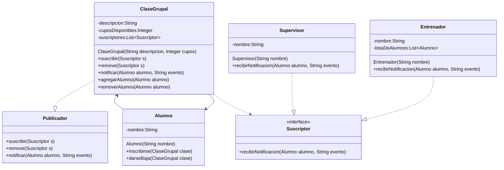

## Escenario: **Clases de Gimnasio y Supervisión de Entrenadores** 🏋️‍♂️

En un gimnasio, los **alumnos** se suscriben a clases grupales (por ejemplo, yoga, spinning, crossfit).

Cada vez que un alumno se inscribe o se da de baja de una clase, el **entrenador** de esa clase debe ser notificado para llevar el control de sus alumnos.

Adicionalmente, existe un **supervisor de entrenadores** que supervisa las inscripciones y bajas de los alumnos, pero **no se preocupa por los detalles de la clase**, solo quiere recibir un aviso cada vez que un alumno se inscribe o se da de baja en cualquier clase para llevar estadísticas globales.

---

### Requisitos clave:

1. Un **Alumno** puede inscribirse en **una o varias clases**.
2. El **Entrenador** de una clase debe recibir la notificación cuando:
    - Un alumno se inscribe.
    - Un alumno se da de baja.
3. El **Supervisor** debe recibir la notificación de todos los cambios, pero **no necesita saber a qué clase pertenece** el cambio.
4. El sistema debe permitir agregar más entrenadores, clases o supervisores sin tener que modificar la lógica existente.

### Requisitos clave:

Justificación de diseño – Escenario Clases de Gimnasio
1. Flexibilidad

El uso de la interfaz Suscriptor permite agregar fácilmente nuevos tipos de observadores (por ejemplo, un sistema de estadísticas o una app móvil) sin modificar el código de las clases existentes.

La interfaz Publicador abstrae el origen de las notificaciones, por lo que cualquier clase que implemente este rol puede publicar eventos.

2. Reusabilidad

La lógica de suscripción/notificación se puede reutilizar en otros contextos (bibliotecas, plataformas online, reservas de hotel, etc.) porque no está acoplada a detalles específicos del gimnasio.

PreferenciasNotificacion centraliza la lista de suscriptores de una clase grupal, evitando que la lógica de manejo de listas se repita.

3. Bajo acoplamiento

Los suscriptores no conocen la implementación interna del publicador, solo reciben eventos a través de un contrato definido (recibirNotificacion).

El publicador no sabe cuántos ni quiénes son sus suscriptores concretos, lo que permite modificaciones independientes.

4. Escalabilidad

Es fácil añadir más clases grupales, entrenadores o supervisores sin tocar la lógica principal.

Se pueden emitir más tipos de eventos (inscripción, cancelación, cambio de horario) simplemente modificando los datos enviados en el método notificar.

5. Claridad y mantenibilidad

Separar responsabilidades:

ClaseGrupal se encarga de su lista de suscriptores.

Alumno gestiona su inscripción y dispara las notificaciones.

Suscriptor define el comportamiento esperado de quienes reaccionan a eventos.

La clase Evento (si se incorpora) encapsula los datos de la notificación, lo que hace que el mensaje sea más claro y extensible.

6. Extensibilidad futura

El diseño permite en el futuro agregar filtros para que solo ciertos suscriptores reciban ciertas notificaciones (por ejemplo, que un entrenador solo reciba eventos de su propia clase).

Se puede conectar un servicio externo (correo, SMS, app) sin cambiar la lógica base, simplemente implementando Suscriptor.
