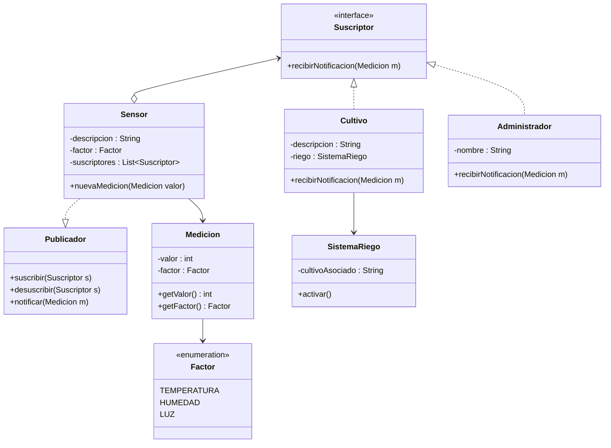

## Escenario: Sistema de Control de Cultivos Inteligentes

En una granja inteligente, hay sensores que miden condiciones como temperatura, humedad del suelo y nivel de luz.

Los cultivos (por ejemplo, tomates, lechuga, frutillas) pueden “suscribirse” para recibir notificaciones cuando cambien ciertas condiciones.

Un administrador de la granja supervisa todos los cultivos y quiere recibir un aviso cuando algún cultivo se suscriba o se dé de baja de un sensor.

Además, un sistema de riego automático debe activarse cuando los sensores detecten valores críticos (por ejemplo, humedad baja).

Los sensores generan eventos cada cierto tiempo y notifican a todos los cultivos y sistemas suscritos.

## Justificación de diseño – Escenario Clases de Gimnasio
### 1. Flexibilidad

El uso de la interfaz Suscriptor permite agregar fácilmente nuevos tipos de observadores (por ejemplo, un sistema de estadísticas o una app móvil) sin modificar el código de las clases existentes.

La interfaz Publicador abstrae el origen de las notificaciones, por lo que cualquier clase que implemente este rol puede publicar eventos.

### 2. Reusabilidad

La lógica de suscripción/notificación se puede reutilizar en otros contextos (bibliotecas, plataformas online, reservas de hotel, etc.) porque no está acoplada a detalles específicos del Sensor.

### 3. Bajo acoplamiento

Los suscriptores no conocen la implementación interna del publicador, solo reciben eventos a través de un contrato definido (recibirNotificacion).

El publicador no sabe cuántos ni quiénes son sus suscriptores concretos, lo que permite modificaciones independientes.

### 4. Escalabilidad

Es fácil añadir más clases  sin tocar la lógica principal.

### 5. Claridad y mantenibilidad

Separar responsabilidades:

<> se encarga de su lista de suscriptores.

<> gestiona su inscripción y dispara las notificaciones.

Suscriptor define el comportamiento esperado de quienes reaccionan a eventos.

La clase Evento (si se incorpora) encapsula los datos de la notificación, lo que hace que el mensaje sea más claro y extensible.

### 6. Extensibilidad futura

El diseño permite en el futuro agregar filtros para que solo ciertos suscriptores reciban ciertas notificaciones
(por ejemplo, que un entrenador solo reciba eventos de su propia clase).
Se puede conectar un servicio externo (correo, SMS, app) sin cambiar la lógica base, simplemente implementando Suscriptor.
